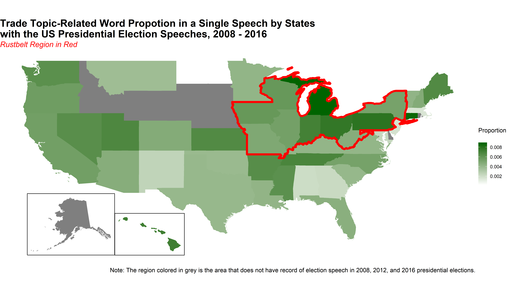

DV HW4
================
Alice Mee Seon Chung
5/26/2018

# Geospatial Visualization

  - *Notes: Here, I included the codes in Rmd file to process the plot
    but I had technique issues in my local computer when knitting the
    codes using package `sf`, so I inserted a image file that I rendered
    from another computer.*

The research question of this text analysis is that how presidential
candidates particularly speak at the stage of delivering presidential
election speeches within specific regions like rust-belt and swing
states. I ran STM(Structural Topic Modeling) with 45 topics with
presidential election speeches from 2008 to 2016.

Firstly, I want to show the degree of trade-topic salience by states in
presidential election speeches from 2008 to 2016 using U.S map. I
already showed the meaning of main variable, the proportion of
trade-related words mentioned in each speech document, and the reason to
select the graphical form in the first assignment, so I will omit those
part to avoid redundancy. From the feedback of the first assignment, I
change the red line to be a single line around the entire rust-belt
region, and I remove the labels of each state for clarity. I encountered
several challenges when creating the graph and majority of the problems
were related with the technical problem of installing packages and the
conflict with system resources. Since the data from `fifty_state`
package have longitude and latitude information but it is hard to make
the dataframe that only contains the single line around the entire
rust-belt region because it is hard to distinguish which data points I
need to use, and the data points are more than 1,000 rows so I can not
work manually to identify the points and I also need to use the
proportion data to draw heatmap on the graph, so it is hard to overlap
those graphs at the same time. So I used stackoverflow to get the
answers(<https://stackoverflow.com/questions/50499363/how-to-draw-the-outline-of-multiple-us-states-in-r/50514884#50514884>)
and from the answers, I first tried to use `regos:gUnion` function, but
it is quite hard to apply to the dataset `fifty_states` from
`fiftystater` since their types of object is different. Instead, I
decided to use `sf` package and `geom_sf` function to draw the single
line. I modified the codes from the answers to apply to my dataset and
filter the rust-belt region and successfully draw the single line.
Additionally, `geom_sf` function has conflict with `ggplot2` function so
I need to add more options to draw desirable geospatial map.

## Topic Correlation Plot and Plot of Topic Constrast between two topics

Next, using the results of STM with 45 topics, I draw correlation plot,
topic contrast plot and wordclouds by four regions using two important
regional distinctions on this research, rust-belt regions and swing
states. Instead of drawing wordcloud by four regions, which I already
did in the research paper, I decided to draw different kinds of
wordcloud, comparison cloud and commonality cloud within regions.

I want to focus on the results of STM by four regions, so I plot the
topic correlation plot and the plot of topical contrast between the
“trade” topic and the farthest topic to see the differences between
the topics within region. The topic correlation plot is somewhat like
network style, so if the topics are related each other then they are
connected by the lines. This plot is easy to detect the distances
between the topics and the distinctiveness of topics. However, this plot
is not an appropriate form to see what words actually topic has. So I
decide to use the plot of topical contrast between two topics to see the
actual contents of the topics and how they are different each other.
Here, I am interested in the “trade” topic, so I choose to draw this
topic and other topic by regions. From the results of STM by each
region, trade-related topic is no.34 in Rust-Swing region and in
Rust-NonSwing region, trade-relatedt topic is no.13. Trade-related topic
is no.35 in NonRust-Swing region and trade-relatedt topic is no.5 in
NonRust-NonSwing region.

As you can see the graphs by each region, “trade” related topic indeed
includes the words related with trade such as job, economi, work, and
tax. You can also find that other accompanying words shows the
characteristic of presidential election speeches by
region.

### Rust/Swing

<!-- --><!-- -->

### Rust/NonSwing

<!-- --><!-- -->

### NonRust/Swing

<!-- --><!-- -->

### Rust/NonSwing

<!-- --><!-- -->

## Wordcloud by regions

In addition to show the topic correlation and the topic contrast plot, I
want to dive into the trade-related topics by each region and see what
words appeared in the topics. As I divided the whole regions into four
categories, I draw wordcloud of “trade” topic for every regions to show
how and what words appeared in the presidential elections and how
presidient candidates frame “trade” to earn the votes. Wordcloud is
efficient to show the importance of each word in the data set because it
uses size and color and the data point itself is a word, so it is
convenient to interpret the data as well. I choose the color palette
starts with yellow, green and blue to strengthen the importance of the
words and set the background color as balck to show yellow colored
words. Blue color means the words appear more and yellow means the words
appear relatively less in the topics. I already implemented the codes
earlier, so I didn’t have any challenges this time to draw this graph
but it was quite confused what color is approproate to deliever the
information that I want to at first time for words and background.

### Rust/Swing

<!-- -->

### Rust/NonSwing

<!-- -->

### NonRust/Swing

<!-- -->

### NonRust/NonSwing

<!-- -->

Overall, we can infer that “trade” is predominantly described with
economic words such as ‘job’, ‘economi’, and ‘tax’. Within rust-belt
region, the trade rhetoric in swing states is more personalized, with
emphasis on ‘worker’ instead of ‘american’. This means when the region
is swing state, then presidential candidates emphasize trade with the
frame of special interest to earn the votes. On the other hand, trade is
linked with national security-related words such as ‘threat’ or ‘secur’
in non-rust-belt region.Presidential candidates talked about trade in
relation to security affairs, for example, ‘cuban embargo’, ‘trade
sanctions’, and ‘immigration’ when they deliver speech in non-rustbelt
regions.

## Comparison Wordcloud and Commonality Wordcloud

Moreover, I extracted the words list by four regions and make them into
one dataframe to draw comparison and commonality wordcloud to catch the
differences and commonalities of word usage in trade-related topics of
each region. As I used the analysis to compare topics within four
regions, so it is more efficient to compare four wordcloud at the same
time using comparison and commonality. Here I use use different color
palette in the previous section because I think the distiction of four
region is the most important part in the comparisosn wordcloud and for
commonality, the color distinction can be made by the color selection
that I choose.

### Comparison Wordcloud

<!-- -->

### Commonality Wordcloud

<!-- -->

The difficuties that I encountered at this part were making a one
dataframe that contains whole word-vocabulary and counts in each topics.
Since STM does not provide the word-frequency pairwise object, I
manually modify the code from their implemented function `cloud` in
`stm` package to return vocabulary and probability of words in each
topic, and then make four dataframes. However, each topic has its own
vocabulary-probability pair, so again, I need to use `join_all` function
to create one dataframe that I can input the parameter in the comparison
wordcloud and commonality wordcloud function.
